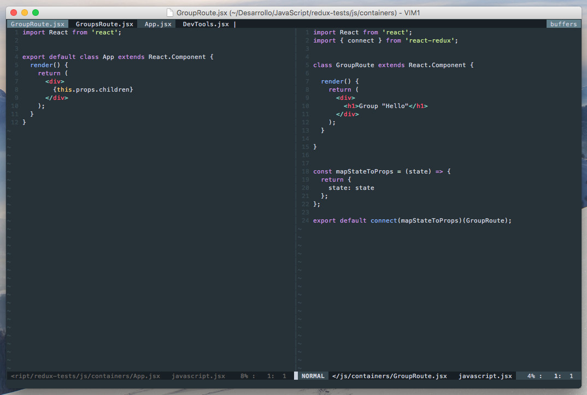
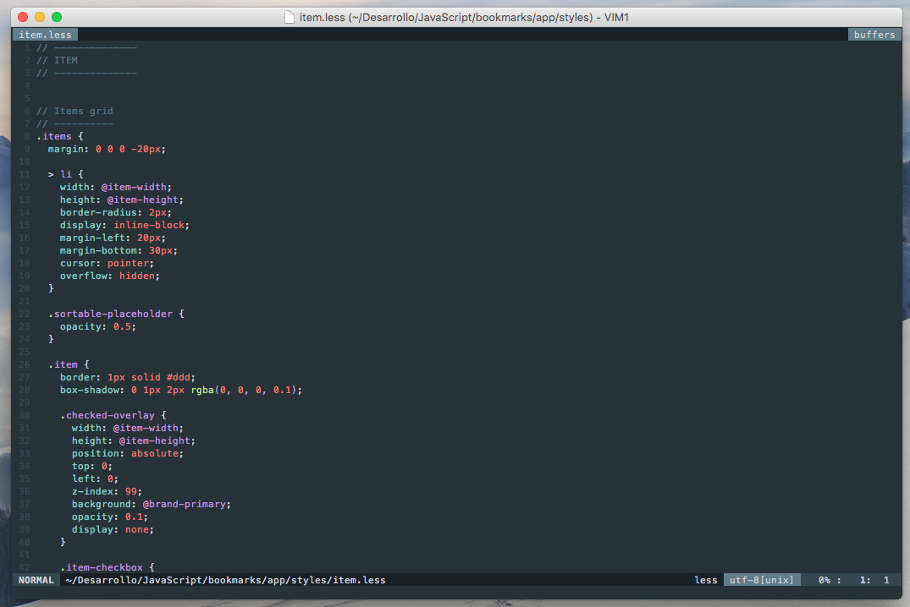

# Vim Vimterial Colorscheme

A vim color scheme based on [Material Theme](http://equinusocio.github.io/material-theme). Improved for web development.

Currently, there is no support for terminal vim, however, it should arrive in the future.


## Target Syntax Highlighting Plugins

This theme has been designed with the following syntax highlighting plugins in mind:

 * JavaScript: [pangloss/vim-javascript](http://equinusocio.github.io/material-theme)
 * JSX: [mxw/vim-jsx](https://github.com/mxw/vim-jsx)
 * HTML5: [othree/html5.vim](https://github.com/othree/html5.vim)
 * XML: []()
 * Jinja: [Glench/Vim-Jinja2-Syntax](https://github.com/Glench/Vim-Jinja2-Syntax)
 * CSS: [JulesWang/css.vim](https://github.com/JulesWang/css.vim)
 * LESS: [genoma/vim-less](https://github.com/genoma/vim-less)
 * Handlebars: [mustache/vim-mustache-handlebars](https://github.com/mustache/vim-mustache-handlebars)

Support for configure and extend the list of supported syntax highlighting plugins is planned. See [colors/syntax/](colors/syntax/) for reference.


## Installation

### Vundle (Recommended)

Installation using [Vundle](https://github.com/VundleVim/Vundle.vim) mentioned for completeness, but it should be similar to the installation of other Vim plugins with whatever installation method you are used to.

Install [Vundle](https://github.com/VundleVim/Vundle.vim) and add this theme as a plugin to your `.vimrc`:

```vim
"...
Plugin 'larsbs/vimterial'
"...
```

Then save the file and run `vim +PluginInstall`


## Screenshots

### Javascript




### HTML


### Python


### LESS


